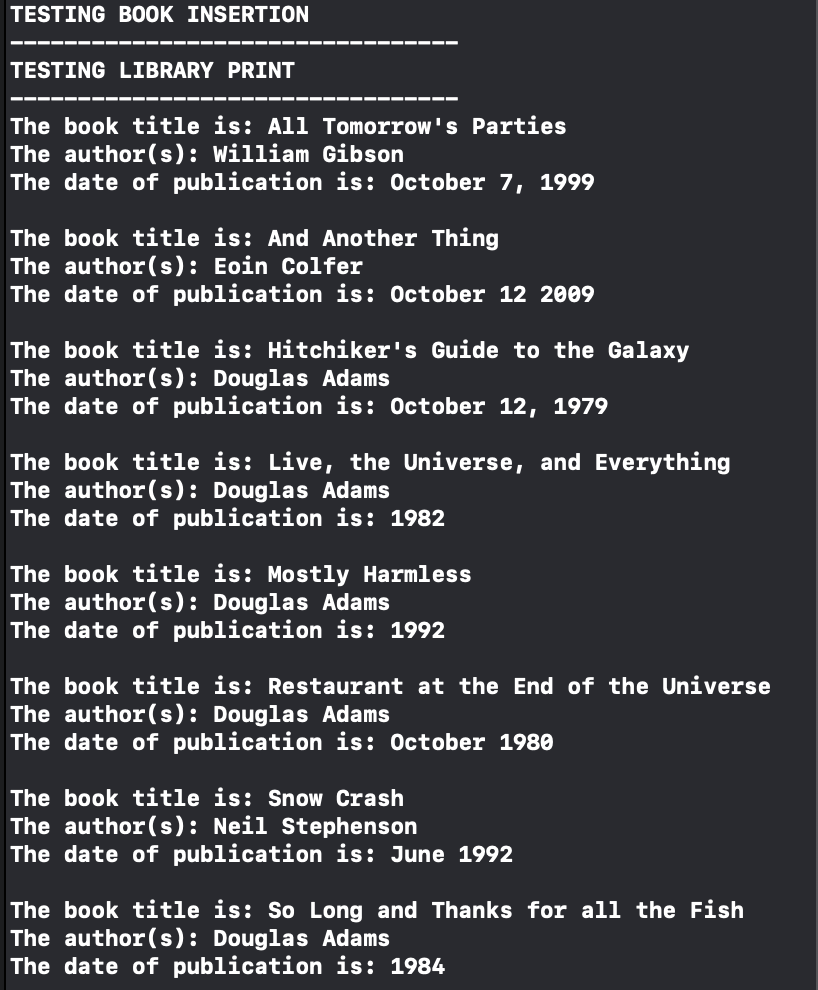
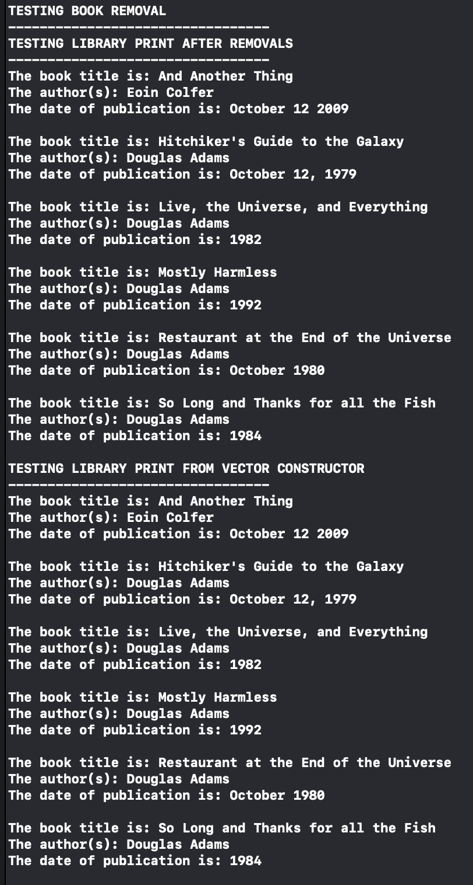
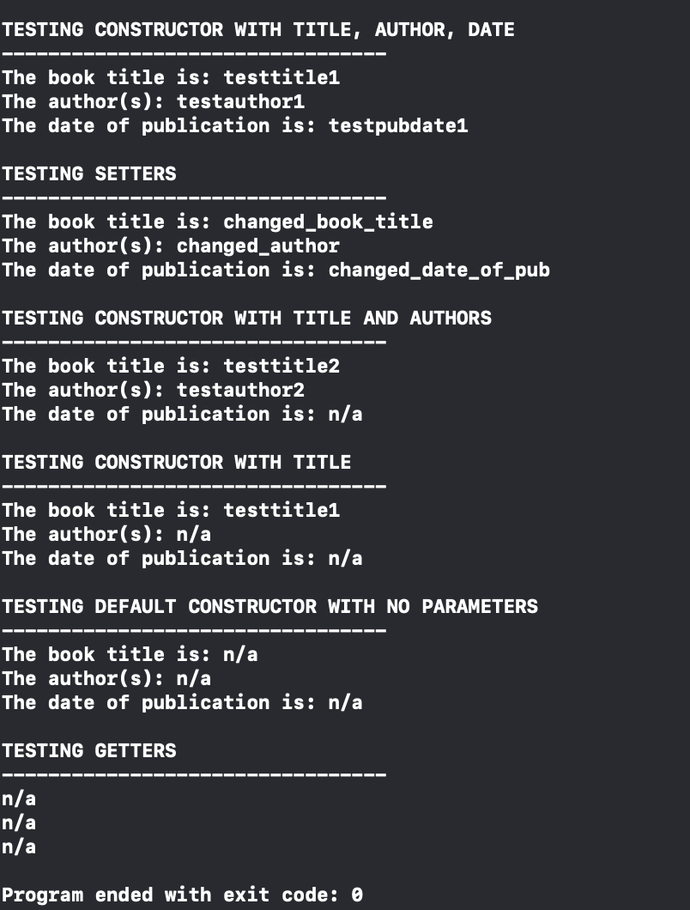

# Library-Simulator

Library simulator using object oriented principles. Book and Library classes to represent objects in a real life library. 

Book attributes protected and accessed using encapsulation attributes. Contains name, author and date of publication 

Library attributes protected and accessed usign encapsulation attributes. Stores an array of type Book and is able to add books or delete books by name or object 

Testing Scenarios:
  

   

   

   
